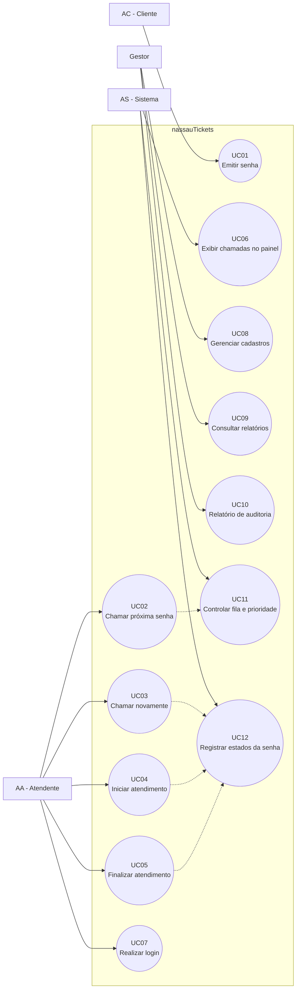

# Casos de Uso — nassauTickets

## 1. Objetivo

O nassauTickets é um Sistema de Controle de Atendimento para um Laboratório de Análises Clínicas. O sistema controla a emissão de senhas, a fila de atendimento, a chamada das senhas, o atendimento nos guichês, o painel de chamadas e os relatórios.

## 2. Atores

### AC — Agente Cliente
Cliente que utiliza o totem de forma anônima para emitir uma senha e aguarda sua chamada no painel.

### AA — Agente Atendente
Responsável por utilizar o sistema no guichê para chamar a próxima senha, iniciar o atendimento, chamar novamente quando necessário e finalizar o atendimento.

### Gestor
Perfil adicional previsto para o atendente, responsável por cadastros e relatórios.

### AS — Agente Sistema
Componente computacional que controla as regras da fila, comunica-se com o banco de dados, emite senhas, atualiza o painel e responde aos comandos dos demais agentes.

## 3. Casos de uso principais

| ID | Caso de uso | Ator principal |
|---|---|---|
| UC01 | Emitir senha | AC |
| UC02 | Chamar próxima senha | AA |
| UC03 | Chamar senha novamente | AA |
| UC04 | Iniciar atendimento | AA |
| UC05 | Finalizar atendimento | AA |
| UC06 | Exibir chamadas no painel | AS |
| UC07 | Realizar login | AA |
| UC08 | Gerenciar cadastros | Gestor |
| UC09 | Consultar relatórios | Gestor |
| UC10 | Gerar relatório de auditoria | Gestor |
| UC11 | Controlar fila e prioridade | AS |
| UC12 | Registrar estados da senha | AS |

## 4. Diagrama de casos de uso

## 5. Descrição dos casos de uso

### UC01 — Emitir senha
O cliente utiliza o totem para emitir uma senha. A senha deve ser de um dos tipos previstos: SP (Prioritária), SG (Geral) ou SE (retirada de Exames). A numeração segue o padrão `YYMMDD-PPSQ`.

### UC02 — Chamar próxima senha
O atendente solicita uma nova senha. O sistema deve selecionar a próxima senha obedecendo às regras de prioridade: SP, depois SE quando disponível e, em seguida, SG.

### UC03 — Chamar senha novamente
Quando o cliente não comparecer imediatamente, o atendente pode realizar uma nova chamada. A segunda chamada deve repetir o áudio e indicar “Última chamada”.

### UC04 — Iniciar atendimento
Após o cliente dirigir-se ao guichê, o atendente inicia o atendimento. A senha passa para o estado `EM_ATENDIMENTO`.

### UC05 — Finalizar atendimento
Ao concluir o atendimento, o atendente encerra o serviço. A senha passa para `ATENDIDA`.

### UC06 — Exibir chamadas no painel
O sistema atualiza o painel de chamadas. Devem ser exibidas as cinco últimas senhas chamadas. A próxima senha não deve ser exibida.

### UC07 — Realizar login
O atendente deve autenticar-se para utilizar as funcionalidades destinadas ao atendimento. O cliente utiliza o totem anonimamente.

### UC08 — Gerenciar cadastros
Funcionalidade destinada ao perfil de gestor para realização dos cadastros previstos pelo sistema.

### UC09 — Consultar relatórios
O gestor pode consultar os relatórios diário e mensal, incluindo quantitativos de senhas, dados por prioridade, tempo médio e informações detalhadas.

### UC10 — Gerar relatório de auditoria
O sistema deve disponibilizar informações de auditoria contendo atendente, guichê, senha, horário da primeira chamada, segunda chamada quando houver, início e finalização do atendimento.

### UC11 — Controlar fila e prioridade
O sistema deve controlar automaticamente a ordem de atendimento segundo as regras definidas para SP, SE e SG. Qualquer guichê pode atender qualquer tipo de senha.

### UC12 — Registrar estados da senha
O sistema deve controlar a máquina de estados da senha:

`EMITIDA → AGUARDANDO → CHAMADA → CHAMADA_NOVAMENTE → EM_ATENDIMENTO → ATENDIDA`

Também deve permitir o estado `NÃO_COMPARECEU` quando o cliente não comparecer após as chamadas previstas.

## 6. Regras relacionadas aos casos de uso

- O expediente ocorre das 7h às 17h.
- Ao final do expediente, senhas ainda presentes na fila devem ser descartadas.
- Uma senha que não for atendida após duas chamadas deve ser considerada abandonada.
- Qualquer guichê pode atender qualquer tipo de senha.
- O padrão de priorização é `[SP] → [SE|SG] → [SP] → [SE|SG]`.
- O painel apresenta as cinco últimas senhas chamadas.
- O cliente interage anonimamente com o totem.
- O sistema deve tratar situações de concorrência quando dois atendentes solicitarem a próxima senha praticamente ao mesmo tempo.
